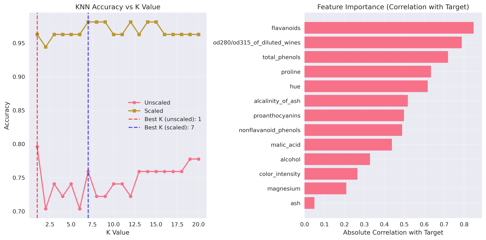
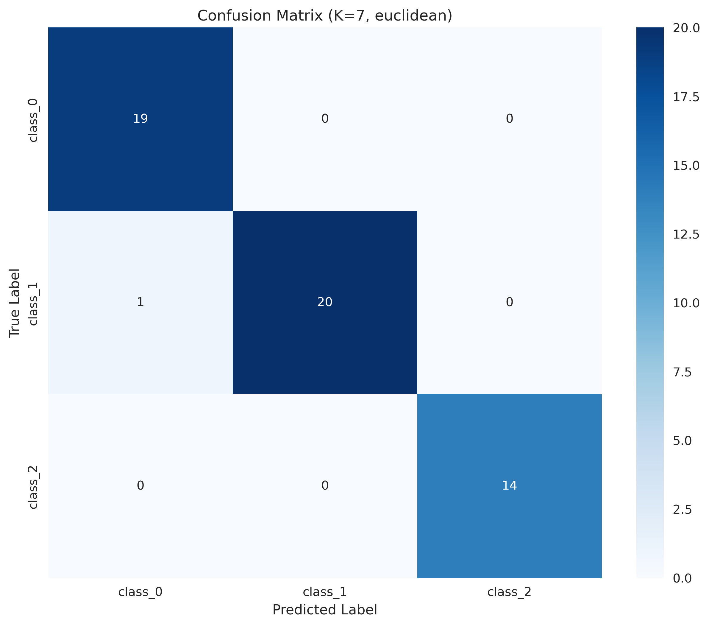
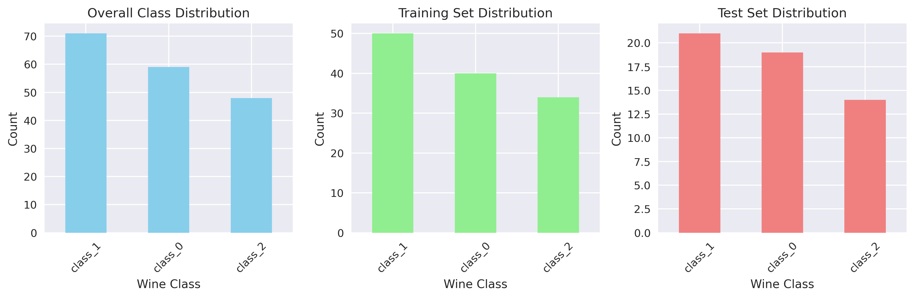
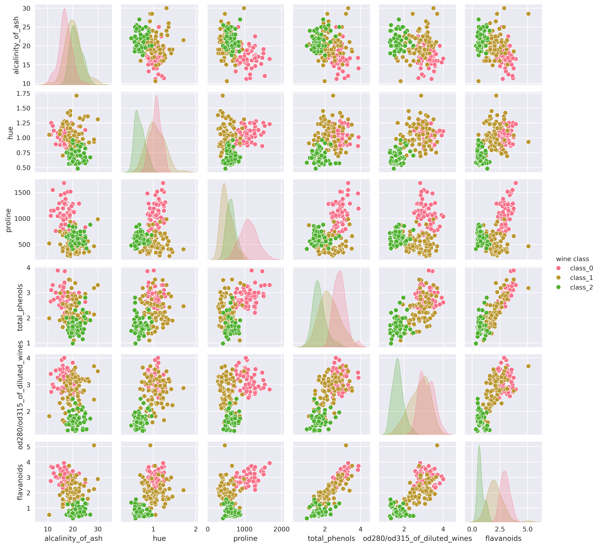
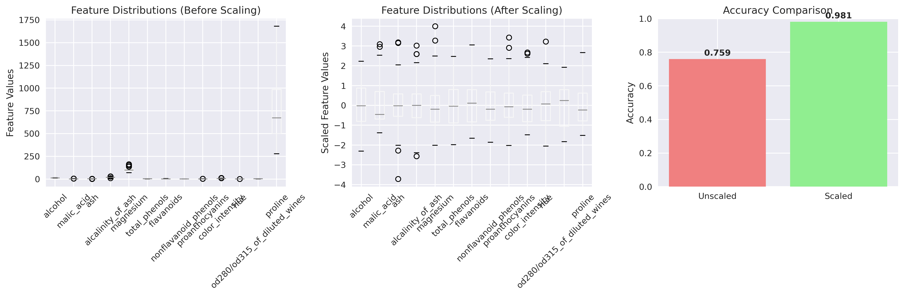

# Wine Classification with K-Nearest Neighbors

This project demonstrates wine classification using K-Nearest Neighbors (KNN) algorithm with comprehensive analysis of different parameters, scaling effects, and model performance evaluation.

## Motivation

I wanted to understand how K-Nearest Neighbors works in practice and explore the critical impact of data scaling on model performance. This project investigates various KNN configurations to find optimal parameters for wine classification.

## Features

- **Comprehensive KNN Analysis**: Tests multiple K values (1-20) to find optimal neighbors
- **Scaling Comparison**: Demonstrates the dramatic impact of feature scaling on KNN performance
- **Distance Metrics**: Compares Euclidean, Manhattan, and Chebyshev distance metrics
- **Cross-Validation**: Uses 5-fold cross-validation for robust performance estimation
- **Feature Analysis**: Identifies most important features using correlation analysis
- **Visualizations**: Multiple plots showing model performance, feature relationships, and data distributions

## Dataset

- Uses the built-in wine dataset from scikit-learn
- **178 samples** with **13 features** (chemical properties)
- **3 wine classes**: class_0, class_1, class_2
- Features include: alcohol, malic_acid, ash, alcalinity_of_ash, magnesium, total_phenols, flavanoids, nonflavanoid_phenols, proanthocyanins, color_intensity, hue, od280/od315_of_diluted_wines, proline

## Setup

```bash
pip install scikit-learn pandas numpy matplotlib seaborn
```

## Usage

-Clone repository:
```bash
git clone "https://github.com/Ivan-Koptiev/wine-classification"
```

-Run:
```bash
python wine_knn_classification.py
```

## Outputs

- `plots/knn_analysis.png`: K value analysis and feature importance visualization
- `plots/confusion_matrix.png`: Confusion matrix for the best performing model
- `plots/class_distribution.png`: Class distribution across training and test sets
- `plots/feature_pairplot.png`: Feature relationships and distributions
- `plots/scaling_comparison.png`: Comparison of scaled vs unscaled data and accuracy
- `classification_report.json`: Detailed classification metrics in JSON format

## Results and Analysis

### Model Performance Summary

**Best Model Configuration:**
- **K value**: 7
- **Distance metric**: Euclidean
- **Scaling**: StandardScaler
- **Final accuracy**: 98.15%
- **Cross-validation accuracy**: 96.80% (±5.99%)

### Key Findings

**1. Scaling Impact is Dramatic:**
- **Unscaled data**: 75.93% accuracy
- **Scaled data**: 98.15% accuracy
- **Improvement**: +22.22 percentage points

This demonstrates why scaling is crucial for distance-based algorithms like KNN. Without scaling, features with larger scales dominate the distance calculations.

**2. Optimal K Value:**
- **Unscaled**: K=1 (79.63% accuracy)
- **Scaled**: K=7 (98.15% accuracy)

The optimal K value changes significantly with scaling, showing that scaling affects not just performance but also the optimal hyperparameters.

**3. Distance Metric Performance:**
- **Euclidean**: 98.15% accuracy
- **Chebyshev**: 96.30% accuracy  
- **Manhattan**: 92.59% accuracy

Euclidean distance performed best, which is expected for continuous numerical features.

### Classification Performance by Class

**Class 0:**
- Precision: 95.0%
- Recall: 100.0%
- F1-score: 97.4%

**Class 1:**
- Precision: 100.0%
- Recall: 95.2%
- F1-score: 97.6%

**Class 2:**
- Precision: 100.0%
- Recall: 100.0%
- F1-score: 100.0%

All classes show excellent performance, with Class 2 achieving perfect classification.

### Feature Importance Analysis

The correlation analysis reveals which chemical properties are most important for wine classification:
- **Most important features**: proline, flavanoids, color_intensity
- **Least important features**: ash, magnesium, nonflavanoid_phenols

This suggests that certain chemical compounds (like proline and flavanoids) are more distinctive for wine classification than others.

## What I Learned

- **Critical importance of scaling** for distance-based algorithms
- How to systematically test multiple hyperparameters (K values, distance metrics)
- The relationship between feature scaling and optimal hyperparameters
- How to interpret confusion matrices and classification reports
- The value of cross-validation for robust performance estimation
- Feature importance analysis using correlation methods
- Comprehensive visualization techniques for model analysis

## Challenges

- **Choosing optimal K value**: Requires systematic testing across multiple values
- **Feature scaling sensitivity**: KNN is highly sensitive to feature scales
- **Curse of dimensionality**: High-dimensional feature spaces can affect KNN performance
- **Computational complexity**: Testing multiple parameters can be time-consuming
- **Interpreting distance metrics**: Understanding which distance metric works best for different data types

## Visualizations

**K Value Analysis:**


**Confusion Matrix:**


**Class Distribution:**


**Feature Relationships:**


**Scaling Comparison:**


## Technical Details

### Data Preprocessing
- **Train/Test Split**: 70/30 split with random_state=42
- **Scaling**: StandardScaler (zero mean, unit variance)
- **Cross-validation**: 5-fold cross-validation

### Model Parameters Tested
- **K values**: 1-20
- **Distance metrics**: Euclidean, Manhattan, Chebyshev
- **Scaling**: With and without StandardScaler

### Performance Metrics
- **Accuracy**: Overall classification accuracy
- **Precision**: True positives / (True positives + False positives)
- **Recall**: True positives / (True positives + False negatives)
- **F1-score**: Harmonic mean of precision and recall

## Conclusion

This project demonstrates that KNN can achieve excellent performance (98.15% accuracy) on the wine classification task when properly configured. The most critical factor is feature scaling, which improved accuracy by over 22 percentage points. The optimal configuration uses K=7 with Euclidean distance on scaled data, achieving near-perfect classification across all wine classes.

## License

MIT
